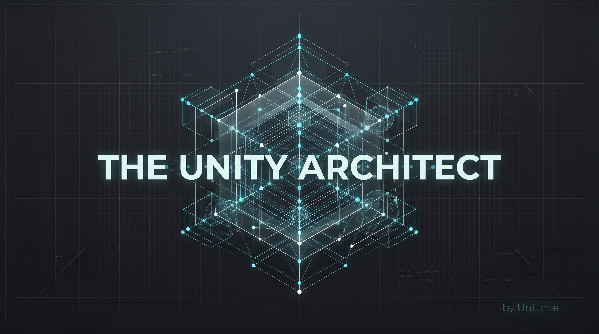

<div align="center">
  <h1>🏛️ The Unity Architect</h1>
  <p><strong>An expert AI agent framework for Unity development.</strong><br/>
  Skills, best practices, and utility scripts — ready to install in one command.</p>

  <a href="https://www.npmjs.com/package/the-unity-architect"></a>
  <a href="LICENSE"></a>
  
  
</div>

---

## You don't have to be a Unity expert to build great games.

You just need the right architect in your corner.

---



# 🏗️ The Unity Architect

**Architect. Debug. Ship.**  
The definitive high-agency AI framework for Unity development.

From concept to complete game—almost entirely by vibe. **The Unity Architect** is a senior-grade framework designed to turn "it doesn't work" into **"fixed systematically."** Whether you are a non-programmer building your vision or a senior dev accelerating your shipping speed, this is your AI technical partner.

---

## 🔗 The Missing Link: Unity MCP Server

To unlock the full potential of this framework, you **MUST** connect it to a Unity MCP Server. Without it, the AI is "blind" to your Scene Hierarchy and Inspector values.

🚀 **Recommended:** [unity-mcp-server (AnkleBreaker Studio)](https://github.com/AnkleBreaker-Studio/unity-mcp-server)

**Why is it mandatory?**  
This framework provides the *intelligence*, but MCP provides the *eyes and hands*. With MCP enabled, the Architect can:
- **Query the Hierarchy:** "Find all objects with missing script references."
- **Inspect Components:** "Verify if the Collider bounds match the Mesh."
- **Deep Search Assets:** "Locate the specific Prefab that handles the inventory UI."
- **God Mode (Natural Language Creation):** Ask the IA to "Create a Player object in the scene with a click-to-move system using MOBA-like best practices for snappy game feel" and watch it build the objects, scripts, and components for you.

> [!TIP]
> **Roadmap:** High-fidelity skills for **UI Toolkit** and **AI Texture Generation** are coming in v1.2.0.

---

It's a framework you install once and forget about. After that, your AI assistant stops being a generic code autocomplete and starts acting like a senior Unity developer who's shipped real games — one who asks the right questions before writing a line of code, follows proven architecture patterns, and knows exactly how to diagnose what's breaking and why.

### For developers who don't know how to code yet

You've heard of "vibe coding" — describing what you want and letting the AI build it. That works for small things. But without structure, the AI builds on sand. Three features in, everything breaks and the AI can't figure out why, because nobody taught it *how Unity actually works*.

The Unity Architect gives the AI that knowledge. The result: you can describe the game you want to build, and the AI will architect it properly — not just make it work today, but make it *stay* working as your game grows.

**You can build a complete game. Almost entirely through conversation.**

### For developers who know Unity well

You know what good architecture looks like. You've refactored enough bad code to have opinions. What you don't want is to explain ScriptableObject event systems, object pooling patterns, or DOTS diagnostics to an AI every single session.

The Unity Architect pre-loads all of that. The AI reads the skill files before acting, follows your established patterns, runs diagnostic scripts when something breaks, and stops making the junior mistakes that slow you down.

**Less time explaining. More time building.**

---

### What is this, technically?

**The Unity Architect** is a plug-and-play framework that transforms any AI coding assistant (Cursor, Antigravity/Gemini, Claude) into a **senior Unity architect and debugger**.

It provides:
- 🧠 **AI Skills** — Structured knowledge files the AI reads to apply expert Unity patterns
- 🛠️ **Execution Scripts** — Node.js & Python utilities for project auditing, dependency graphs, and log parsing
- ⚡ **Auto-configuration** — Automatically wires itself into your AI tool's config (`.cursorrules`, `.gemini/agents.md`, `CLAUDE.md`)

---

## Quick Install

Run this from the **root of your Unity project**:

```bash
npx the-unity-architect
```

That's it. The installer will:

1. Create a `skills/` folder with expert AI guidance files
2. Create an `execution/` folder with diagnostic scripts
3. Inject rules into your AI tool's config so it reads the skills automatically

### Options

```bash
npx the-unity-architect --dry-run   # Preview what will be installed (no changes)
npx the-unity-architect --force     # Skip Unity project detection, install anywhere
```

---

## What Gets Installed

### `skills/` — AI Knowledge Base

| Skill | Description |
|-------|-------------|
| `unity-systematic-debugging/` | Step-by-step scientific debugging protocol for Unity |
| `unity-architecture-and-best-practices/` | Clean code, design patterns, and modular system architecture |
| `unity-ui-toolkit/` | Unity 6 UI Toolkit best practices, GPU optimization, and Flexbox standards |
| `unity-feature-pipeline/` | End-to-end product engineering: Design interrogation, GDD documentation, and Issue slicing |

Each skill folder contains a `SKILL.md` (the main AI directive) plus detailed reference modules:

**Systematic Debugging modules:**

- `01-scientific-method-and-logs.md` — Hypothesis-driven debugging with Unity logs
- `02-state-and-serialization.md` — Inspector state, serialization pitfalls
- `03-memory-and-gc-profiling.md` — Memory leaks, GC pressure, Profiler workflow
- `04-dots-and-ecs-diagnostics.md` — DOTS/ECS specific debugging techniques
- `05-rendering-and-gpu-bottlenecks.md` — GPU profiling and render pipeline issues

**Architecture & Best Practices modules:**

- `01-planning-and-workflow.md` — Technical planning before coding
- `02-clean-code-and-conventions.md` — Naming, SOLID, Unity conventions
- `03-core-design-patterns.md` — ScriptableObject events, State Machine, Command pattern
- `04-modular-systems-and-glue-code.md` — Service Locator, dependency injection
- `05-ui-and-presentation-architecture.md` — MVP/MVC for Unity UI
- `06-combat-and-vfx-decoupling.md` — Data-driven combat, pooling VFX
- `07-performance-coding-patterns.md` — Burst, DOTS, Job System, object pooling

### `Unity/Editor/` — Architect Kit (C# Tools)

Herramientas nativas para el editor de Unity que facilitan la interacción con la IA.

- `ArchitectKitSceneInsight.cs` — Exporta la jerarquía de la escena activa a JSON para análisis profundo de la IA.

### `execution/` — Diagnostic Scripts

| Script | Command | Description |
|--------|---------|-------------|
| `unity-doctor.js` | `node execution/unity-doctor.js` | Full project health check |
| `unity-audit.js` | `node execution/unity-audit.js` | Code quality and anti-pattern audit |
| `unity-project-graph.js` | `node execution/unity-project-graph.js` | Scene and dependency graph |
| `package-audit.js` | `node execution/package-audit.js` | Package & UPM dependency checker |
| `parse_editor_log.py` | `python execution/parse_editor_log.py` | Parse Editor.log for errors |
| `find_missing_scripts.py` | `python execution/find_missing_scripts.py` | Find missing MonoBehaviour references |
| `scaffold_repo.py` | `python execution/scaffold_repo.py` | Scaffold a new module/system |

---

## How the AI Uses This

After installation, your AI assistant will automatically:

1. **Read the relevant SKILL.md** before writing code or debugging
2. **Run diagnostic scripts** when asked to audit or inspect the project
3. **Follow expert Unity patterns** from the knowledge modules
4. **Integrate with Unity MCP** if available in the session

The AI is trained to summarize which rules it's applying (token-saving protocol) before acting, so you always know what framework it's following.

---

## 🧠 The Mega-Brain Wiki (Trigger-Based Maintenance)

The Unity Architect doesn't just write code—it builds a **persistent conceptual knowledge base** of your game.

Code and JSON files tell the AI *what* the game is. But they don't explain *why* it is that way (the lore, the discarded ideas, the architectural decisions). To solve this, the framework silently maintains a Markdown Wiki in `Docs/Wiki/`.

Instead of wasting tokens trying to update the wiki on every message, the AI uses **Triggers**:
- **Trigger 1 (Feature Finalization):** When the AI finishes writing a Game Design Document (GDD), it automatically updates the Wiki's `Index.md` and `Log.md`, and categorizes the new systems.
- **Trigger 2 (Architecture Decisions):** When you and the AI agree on a major technical pattern, the AI writes an Architecture Decision Record (ADR) in `Docs/Wiki/ADR/` so it never forgets the technical context.
- **Trigger 3 (Manual Librarian):** You can ask the AI to "update the wiki" at the end of a session to clean up the lore, systems, and glossary.

This gives the AI a persistent "Mega-Brain" across long development cycles, without sacrificing coding speed.

---

## Works With

| Tool | Config File Created/Updated |
|------|-----------------------------|
| **Cursor** | `.cursorrules` |
| **Antigravity / Gemini** | `.gemini/agents.md` |
| **Claude Code** | `CLAUDE.md` |
| **Windsurf** | `.windsurfrules` |

If none are detected, defaults to creating `.cursorrules`.

> [!TIP]
> **Upgrading?** The installer now detects previous versions and offers an **interactive clean-up** to ensure your project stays tidy.

```text
                      A R C H I T E C T  v1.2.2
```

## 🛠️ The Architect Toolkit (v1.2.2)

Everything is now centralized under the `The-Unity-Architect/` directory to keep your project clean:

- **`The-Unity-Architect/skills/`**: Domain-specific guidance for your AI (Architecture, Debugging, Pipeline).
- **`The-Unity-Architect/execution/`**: Powerful Node/Python scripts for auditing and debugging.
- **`The-Unity-Architect/Wiki/`**: The "Mega-Brain" conceptual source of truth (ADRs, Lore, Systems).
- **`agents.md`**: (Project Root) The soul of your AI, created automatically in the root of your project.

---

## 🧠 The Mega-Brain Wiki Protocol

This framework implements an **Autonomous Wiki** that your AI maintains. It uses three triggers to ensure no conceptual context is lost:

1. **Trigger 1 (GDD Approval):** When a feature design is finalized, the AI summarizes it in `Wiki/Systems/`.
2. **Trigger 2 (Architecture Decisions):** Major technical choices are recorded as **ADRs** (Architecture Decision Records) in `Wiki/ADR/`.
3. **Trigger 3 (Manual Librarian):** Say **"Update the wiki"** anytime to have the AI consolidate recent lore or mechanics.

---

## 🎨 Professional Standards (Unity 6)

The Unity Architect is optimized for **Unity 6** and modern development:

- **UI Toolkit First:** Rigid standards for high-performance USS and UXML.
- **GAS-Lite Architecture:** Modular systems that don't depend on Monolithic managers.
- **Scientific Debugging:** A protocol to stop "guess-fixing" and start diagnosing.

---

## 🤝 Sponsorship & Support

If this framework helps you build better games, consider supporting the project!

- **GitHub Sponsors:** [Support the Lince](https://github.com/sponsors/UnLince) 🐾

If **The Unity Architect** helps you build better games faster, consider supporting its development:

[**Sponsor on GitHub**](https://github.com/sponsors/UnLince)

---

## Contributing

Contributions are welcome! If you have Unity skills, patterns, or scripts to add:

1. Fork the repo
2. Add your skill folder under `templates/skills/your-skill-name/`
3. Include a `SKILL.md` with clear AI directives
4. Open a PR with a description of what the skill covers

---

## License

MIT © [UnLince](https://github.com/UnLince)
